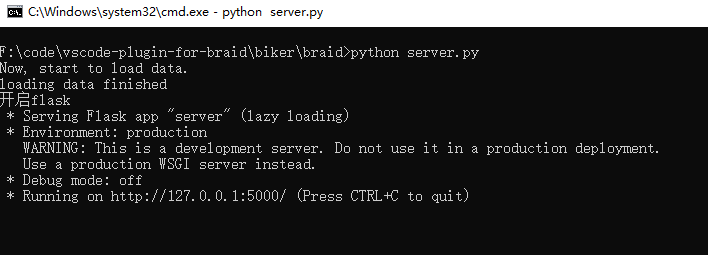
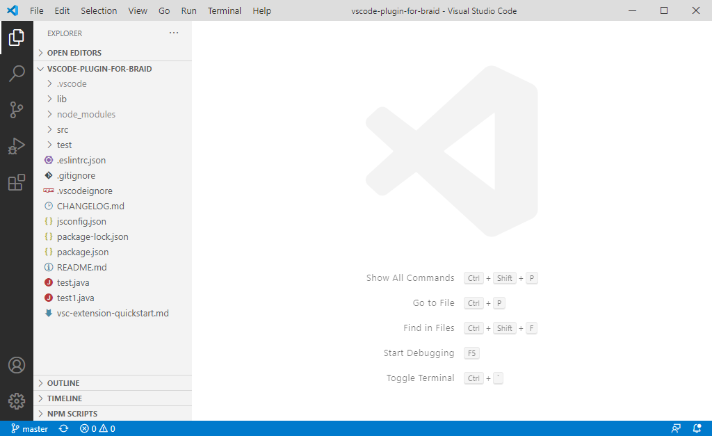
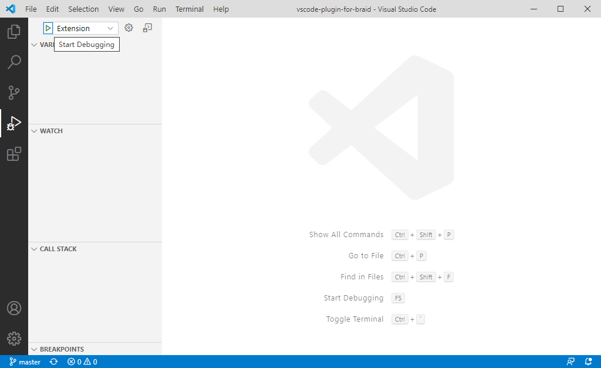
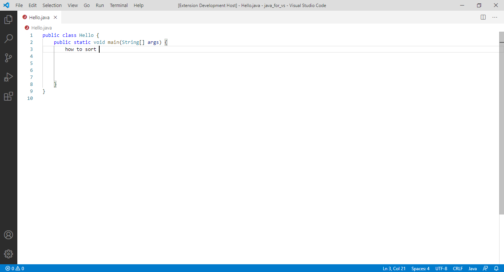
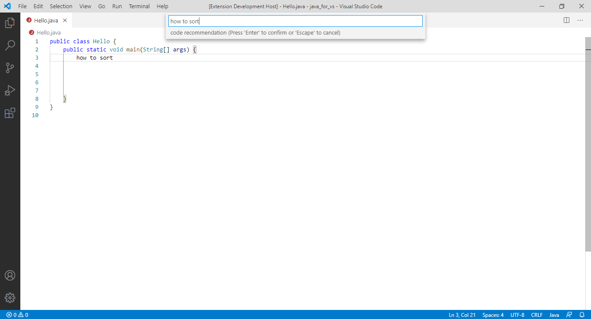
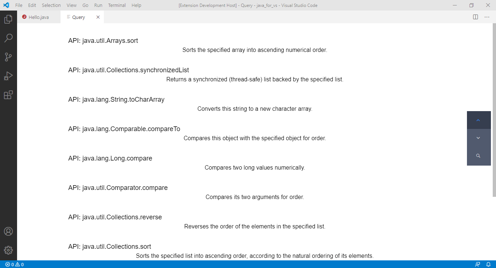
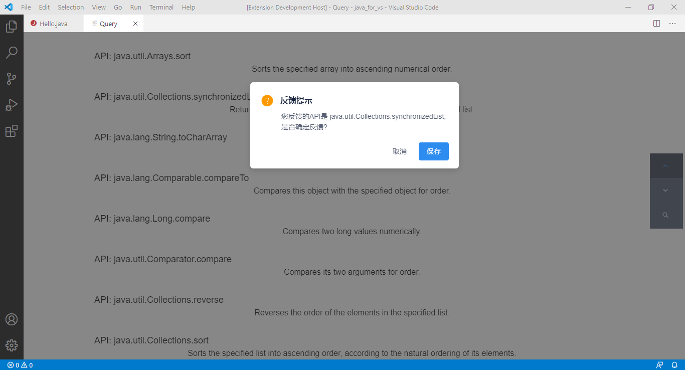

# vscode plugin for braid

A vscode plugin for braid.

## Installation

step1. git clone https://github.com/yyyxy/vscode-plugin-for-braid.git . then `cd vscode-plugin-for-braid`

step2. change directionary to biker/braid, using command `cd biker/braid` 

step3. install the required libraries , using command `pip install -r requirements.txt`

step4. start backend server, using command `python server.py`

step5. open plugin-end code folder with [vscode editor](https://code.visualstudio.com/).

step6. change to panel `Run`, click the `Start Debugging` button. then vscode will open a new window for you to test the plugin.

## Usage

step1. `Ctrl+F9` (windows,Linux) or `Cmd+F9` (OSX), and type your query string, for example, "how to sort"

step2. view the query results

step3. click the desired item to feedback your selection.

